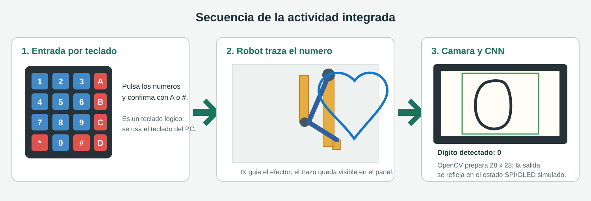
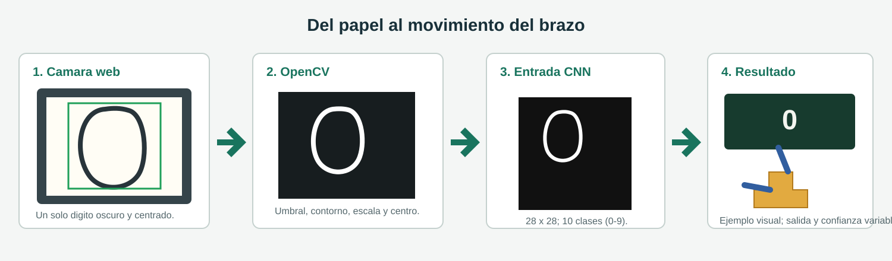
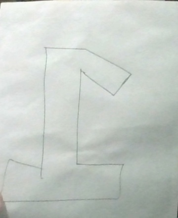
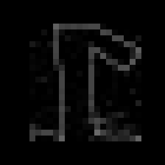

# Teclado, webcam y brazo robotico en PyBullet

Actividad de escritorio que integra una entrada tipo teclado matricial, una simulacion de brazo en PyBullet y reconocimiento de digitos escritos a mano con OpenCV y una CNN entrenada con MNIST. No requiere ESP32, pantalla OLED ni teclado matricial fisicos.



La ilustracion explica el flujo de la aplicacion; es un diagrama de referencia y no una captura literal de PyBullet. La webcam y las ventanas de simulacion se muestran en tiempo real al ejecutar el programa.

## Que hace

La escena reutiliza el ejemplo de KUKA de `6) Ejemplos_pybullet/brazo` como referencia de PyBullet y cinemática inversa. En lugar de enviar el brazo a un punto aleatorio, propone puntos ordenados para recorrer el contorno de cada digito sobre un tablero. El robot carga el modelo `kuka_iiwa` que distribuye PyBullet.

La entrada se puede hacer de dos maneras:

- **Teclado del PC:** las teclas `0` a `9` cargan digitos en un búfer, igual que pulsar las teclas azules del teclado 4x4. `A` o `#` confirman el búfer y el robot dibuja los digitos en orden.
- **Webcam:** OpenCV busca un trazo oscuro dentro del recuadro verde. La imagen se centra y transforma a 28 x 28 píxeles, y la CNN calcula una clase de 0 a 9. Una votacion de varios fotogramas reduce cambios espurios; si la confianza alcanza el umbral, el digito se añade a la simulacion sin pulsar teclas.

El estado de PyBullet representa el dato recibido y el recorrido. Esto permite practicar el flujo equivalente a cámara -> OpenCV -> CNN -> dato -> brazo sin conectar una placa. La transferencia SPI y la pantalla OLED de las imagenes de la actividad son representaciones logicas: no se genera una señal SPI real ni una pantalla física.



## Requisitos

- Windows 10/11 de 64 bits.
- Python 3.11 recomendado. TensorFlow dispone de paquetes para esta version; evita usar Python 3.14 para instalar las dependencias de esta actividad.
- Webcam conectada para reconocimiento en vivo. Sin cámara, el teclado virtual y PyBullet siguen disponibles.
- Conexión a Internet durante la primera instalación y la primera descarga de MNIST para entrenar el modelo.

Paquetes de Python declarados en `requirements.txt`: NumPy, OpenCV, PyBullet y TensorFlow. La simulacion no utiliza Arduino, ESP32, puerto serie ni componentes I2C/SPI físicos.

## Instalacion

La opcion recomendada en Windows es usar Miniforge/Conda, porque conda-forge ofrece PyBullet precompilado:

```powershell
conda env create -f environment.yml
conda activate pybullet-digitos
```

La primera instalación descarga varios cientos de megabytes: TensorFlow por sí solo ocupa alrededor de 351 MB en Windows, además de PyBullet, OpenCV y sus dependencias.

Si se usa un entorno `venv` y `pip`, la distribucion de PyPI compila PyBullet desde código fuente en Windows. Para esa ruta se requiere Visual Studio Build Tools con la carga de trabajo **Desarrollo para el escritorio con C++** y el SDK de Windows.

Abre PowerShell en esta carpeta. Si Python 3.11 está instalado, crea un entorno separado para la actividad:

```powershell
py -3.11 -m venv .venv
.\.venv\Scripts\Activate.ps1
python -m pip install --upgrade pip
python -m pip install -r requirements.txt
```

Si PowerShell bloquea la activacion del entorno, ejecuta Python directamente sin activarlo:

```powershell
py -3.11 -m venv .venv
.\.venv\Scripts\python.exe -m pip install --upgrade pip
.\.venv\Scripts\python.exe -m pip install -r requirements.txt
```

## Preparar el reconocedor

El modelo entrenado `modelo_mnist_cnn.keras` se incluye junto al programa, así que se puede iniciar la cámara directamente sin volver a entrenar ni descargar MNIST. Para entrenar una nueva versión de la CNN, desde esta carpeta ejecuta:

```powershell
python entrenar_modelo.py
```

La primera ejecucion descarga MNIST. El entrenamiento tarda unos minutos y deja `modelo_mnist_cnn.keras` junto al programa. No es necesario repetirlo mientras se conserve ese archivo. Este modelo reconoce dígitos parecidos a los ejemplos MNIST; no es un OCR general y su precisión con papel real depende del tamaño del trazo, el contraste, el fondo y la iluminación.

## Iniciar la simulacion

Con el entorno activado y el modelo creado:

```powershell
python main.py
```

Se abren la ventana de PyBullet y las ventanas de cámara, preprocesamiento y OLED virtual de OpenCV. Coloca una hoja blanca con un solo dígito oscuro dentro del marco verde. Procura que el dígito sea grande, esté completo, no toque el borde del marco y contraste claramente con el papel. Mantén la hoja quieta un instante para que se estabilice la predicción.

En la ventana de la cámara se ve el recorte y el resultado de OpenCV. Otra ventana amplía la imagen 28 x 28 usada como entrada de la red. La pantalla OLED virtual muestra el último dato y si llegó del teclado o de la webcam. Al aceptar un dígito, el brazo recorre su trazo en el tablero de PyBullet y el estado indica que se recibió por el enlace virtual.

### Prueba real con la webcam

La siguiente fotografía se capturó con la webcam durante una prueba local. Se recortó para mostrar únicamente la hoja. La imagen inferior es la entrada MNIST de 28 x 28 píxeles que produjo el mismo preprocesamiento de la aplicación.





En esta toma la CNN propuso la clase `5` con `15,8 %` de confianza, por debajo del umbral de `60 %`. Por eso la aplicación la presenta como **Sin confirmar** y no envía ningún número al brazo. El trazo de esta prueba es fino y dibujado como contorno; para una lectura aceptada, escribe un solo dígito oscuro, sólido y centrado, similar a los ejemplos MNIST.

## Teclas del teclado matricial

Usa la fila superior del teclado del PC para introducir los dígitos y las teclas indicadas para las funciones. La ventana de PyBullet debe tener el foco para leer las teclas.

| Tecla del PC | Tecla matricial | Funcion |
| --- | --- | --- |
| `0` a `9` | Teclas numéricas | Añade el dígito al búfer de entrada. |
| `A` o `Enter` | `A` / `#` | Envía los dígitos acumulados y programa el trazado. `#` también funciona como confirmación. |
| `*` | `*` | Borra el último dígito del búfer. |
| `B` | `B` | Vacía el búfer sin modificar el dibujo. |
| `C` | `C` | Limpia los trazos que ya aparecen en el tablero. |
| `D` | `D` | Cancela la cola pendiente y mueve el efector hacia la posición inicial. |
| `Esc` | — | Cierra la aplicación. También se puede pulsar `q` en la ventana de cámara. |

Las teclas `1` a `9`, `A` a `D`, `*`, `0` y `#` conservan la distribución de un teclado matricial 4 x 4. Las letras A-D actúan como controles del demo, no como dígitos.

## Recorrido interno de un dígito

1. **Captura:** `cv2.VideoCapture(0)` abre la webcam predeterminada. La imagen se refleja para que el movimiento frente a la cámara resulte natural.
2. **Región de interés:** un cuadrado centrado ocupa aproximadamente el 62 % del lado menor del fotograma. El marco verde indica el área procesada.
3. **Preprocesamiento:** OpenCV convierte a escala de grises, aplica un desenfoque ligero, umbral adaptativo invertido, toma el contorno mayor, conserva la proporción y lo centra en una imagen negra de 28 x 28.
4. **Clasificación:** la CNN produce diez probabilidades. Se usa la clase con mayor probabilidad y se requiere confianza mínima de 60 % junto con estabilidad en al menos cuatro de los últimos cinco fotogramas.
5. **Envío virtual:** el dígito reconocido se trata como el dato que la cadena de la actividad enviaría al maestro SPI. El estado de la escena deja visible el dato y su origen (teclado o webcam).
6. **Movimiento:** cada dígito tiene una lista de trazos en coordenadas normalizadas. PyBullet calcula posiciones de articulación con cinemática inversa y anima el KUKA; el trazo se conserva como línea en el tablero.

## Relacion con los ejemplos del punto 6

Los cuatro ejemplos originales ilustran partes diferentes de PyBullet y se mantienen sin cambios:

- `brazo/main.py` carga un KUKA y demuestra `calculateInverseKinematics`; esta actividad reutiliza esa idea para seguir puntos definidos en el tablero, no un objetivo aleatorio.
- `robot/main.py` carga `two_joint_robot_custom.urdf` y controla articulaciones con deslizadores. Su URDF de dos juntas sirve como referencia de carga y control de modelos propios; para trazar dígitos con más alcance se usa el KUKA de PyBullet.
- `carro/main.py` muestra control de articulaciones del modelo de carro y avance de la simulacion.
- `bipedo/main.py` ejemplifica control de posición tipo PD sobre articulaciones de un URDF local.

En todos los casos se conserva el patrón central: cargar un modelo URDF, fijar gravedad, enviar consignas a las articulaciones y avanzar el mundo con `stepSimulation()`.

## Resolucion de problemas

- **No aparece la cámara:** comprueba los permisos de cámara de Windows, cierra otras aplicaciones que la estén usando o conecta la webcam antes de iniciar. PyBullet sigue aceptando el teclado si `VideoCapture(0)` no puede abrirla.
- **El recuadro no encuentra el dígito:** usa papel claro, tinta oscura, buena iluminación uniforme y un dígito aislado. Evita sombras, líneas del cuaderno, varios dígitos y trazos muy finos.
- **La ventana dice que falta el modelo:** activa el entorno e inicia `python entrenar_modelo.py`. Si la cámara se abre sin modelo, el control por teclado continúa funcionando.
- **No responde el teclado:** haz clic en la ventana 3D de PyBullet antes de pulsar las teclas. Para enviar una secuencia, pulsa `A` o `Enter` al terminar.
- **Falla la instalación de TensorFlow:** confirma que el entorno fue creado con `py -3.11` y que está activado. No instales los paquetes con un Python distinto del que ejecutará `main.py`.
- **El brazo no traza igual que la escritura:** el movimiento es una demostración geométrica de contornos en el espacio de PyBullet. No modela lápiz, contacto, fuerzas de escritura ni calibración de un brazo físico.

## Limites del prototipo

El reconocimiento y la simulación se ejecutan localmente. El único conjunto usado para entrenar es MNIST, compuesto principalmente por dígitos centrados en escala de grises; la escritura en una webcam tiene variaciones de cámara y entorno que MNIST no representa. Los umbrales del preprocesamiento pueden requerir ajustes para otras cámaras. SPI, el OLED, el teclado matricial y el ESP-A/ESP-B se representan en software y no sustituyen la implementación electrónica.